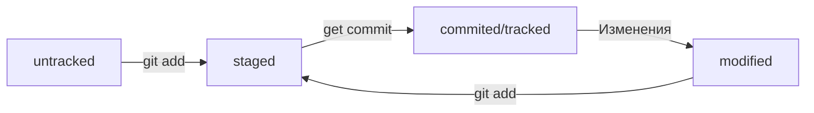

# Это шпаргалка по git


### Быстрый старт ---
1. Перейдите в нужную директорию при помощи *cd*
2. Проинициализируйте git командой "*git init*". Создастся папка .git
3. Привязываем удаленный репозиторий: Укажите ssh-ссылку на ваш репозиторий "*git remote add origin ссылка-ssh*"  
Проверить, что репозиторий привязан: "*git remote -v*"
4. После создания новых файлой или изменения файлов добавляйте их перед коммитом: *git add --all* - добавит все измененные файлы  
*Можно проверить состояние git при помощи "git status"*
5. После необходимых преобразований добавьте новый коммит:
"git commit -m "your message"
6. Пушим наши коммиты на репозиторий: "*git push*". 
Если это наш первый пуш, то необходимо указать мастер-ветку:
```bash
git push -u origin master
```  


### Привязка вашего аккаунта Github к git на компьютере через ssh
* #### Создание SSH-ключа  
```Bash
$ ssh-keygen -t ed25519 -C "электронная почта, к которой привязан ваш аккаунт на GitHub"
ИЛИ
$ ssh-keygen -t rsa -b 4096 -C "электронная почта, к которой привязан ваш аккаунт на GitHub"
```  
Это две команды алгоритмов генерации ssh-ключа. Выбирайте одну из них
* #### Передача ключа Github-у  
Теперь скопируйте содержимое публичного ключа:  
```Bash
$ clip < ~/.ssh/id_rsa.pub
```  
Загрузите этот ключ на Gitnub


### Хеширование коммитов в git   
Хэш - это уникальный идентификатор коммита. Если вы знаете хэш, то вы можете узнать все остальное: автора, дату коммита, содержимое закомиченных файлов.  
Хэши всех коммитов хранятся в папке .git


### Описание коммита
При вызове git log появится список коммитов и их краткое описание
```Bash
git log
```  
Разберём элементы, из которых состоит описание:

- строка из цифр и латинских букв после слова **commit** — это хеш коммита;
- **Author** — имя автора и его электронная почта;
- **Date** — дата и время создания коммита;
- в конце находится сообщение коммита.

### Получить сокращённый лог — `git log --oneline`

Получить сокращённый лог можно с помощью команды `git log` с флагом `--oneline` (англ. «одной строкой»). В терминале появятся только первые несколько символов хеша каждого коммита и их комментарии.

### Файл `HEAD`

Файл `HEAD` (англ. «голова», «головной») — один из служебных файлов папки `.git`. Он указывает на коммит, который сделан последним (то есть на самый новый).

Внутри `HEAD` — ссылка на служебный файл: `refs/heads/master` (или `refs/heads/main` в зависимости от названия ветки). Если заглянуть в этот файл, можно увидеть хеш последнего коммита.

Когда вы делаете коммит, Git обновляет `refs/heads/master` — записывает в него хеш последнего коммита. Получается, что `HEAD` тоже обновляется, так как ссылается на `refs/heads/master`.

### Статусы файлов в Git

Файлы в git могут иметь один из 4 статусов:
- **untracked** - неотслеживаемый. Этот статус получают новые файлы, которые ни разу не были добавлены и закомиченны
- **staged** - на сцене. Этот статус получают файлы, для которых вызвали `git add`. То есть файлы войдут в коммит
- **tracked** - отслеживаемый. Этот статус файлы получают если хоть раз были закомиченны или добавлены. Т.е. git отслеживает из изменения
- **modified** - измененный. Этот файл отслеживается, и git заметил изменения файла, однако он не добавлен в staging area. то есть в коммите пока что его старая версия.  


### Как изменяются состояния файлов



### Про git status

Большинство файлов в типичном проекте будут находиться в состоянии `tracked` (то есть закоммичены и не изменены после коммита). Вы не увидите это состояние в выводе команды `git status` — иначе она бы каждый раз выводила список вообще всех файлов проекта.

В итоге `git status` показывает только следующие состояния файлов:

- `staged` (`Changes to be committed` в выводе `git status`);
- `modified` (`Changes not staged for commit`);
- `untracked` (`Untracked files`).


### Про работу с ветками

#### Клонирование чужого репозитория

_git clone git@github.com:YandexPraktikum/first-project.git (от англ. clone, «клон», «копия»)_ — склонируй репозиторий с URL first-project.git из аккаунта YandexPraktikum на мой локальный компьютер.

#### Создание веток

_git branch feature/the-finest-branch (от англ. branch, «ветка»)_ — создай ветку от текущей с названием feature/the-finest-branch;

_git checkout -b feature/the-finest-branch_ — создай ветку feature/the-finest-branch и сразу переключись на неё.

#### Навигация по веткам
_git branch (от англ. branch, «ветка»)_ — покажи, какие есть ветки в репозитории и в какой из них я нахожусь (текущая ветка будет отмечена символом *);

_git branch -a_ — покажи все известные ветки, как локальные (в локальном репозитории), так и удалённые (в origin, или на GitHub).

_git checkout feature/br_ — переключись на ветку feature/br.

#### Сравнение веток
_git diff main HEAD_ (от англ. difference, «отличие», «разница») — покажи разницу между веткой main и указателем на HEAD;

_git diff HEAD~2 HEAD_ — покажи разницу между тем коммитом, который был два коммита назад, и текущим.

#### Удаление веток
_git branch -d br-name _— удали ветку br-name, но только если она является частью main;

_git branch -D br-name_ — удали ветку br-name, даже если она не объединена с main.

#### Слияние веток
_git merge main_ (от англ. merge, «сливать», «поглощать») — объедини ветку main с текущей активной веткой. 

#### Работа с удалённым репозиторием
_git push -u origin my-branch_ (от англ. push, «толкнуть», «протолкнуть») — отправь новую ветку my-branch в удалённый репозиторий и свяжи локальную ветку с удалённой, чтобы при дополнительных коммитах можно было писать просто git push без -u;

_git push my-branch_ — отправь дополнительные изменения в ветку my-branch, которая уже существует в удалённом репозитории;

_git pull_ (от англ. pull, «вытянуть») — подтяни изменения текущей ветки из удалённого репозитория.